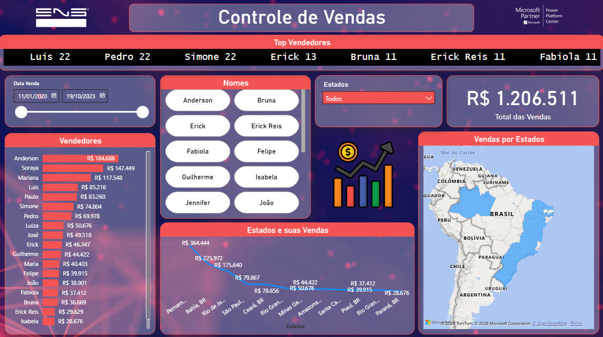

# 📊 Dashboard de Vendas

Este é meu primeiro dashboard publicado no GitHub que fiz através de um curso da empresa ENG.
O objetivo é analisar o desempenho de vendas ao longo do tempo.

## 🛠️ Ferramentas
- Power BI
- Excel / (base de dados)

## 📈 Indicadores
- Top Vendedores
- Vendas por região / estado
- Vendas por região / estado (utilizando gráfico de mapa)

## 🔍 Insights
- O estado de Pernambuco lidera o faturamento
- O vendedor líder de faturamento foi o Anderson

## 🖼️ Preview

